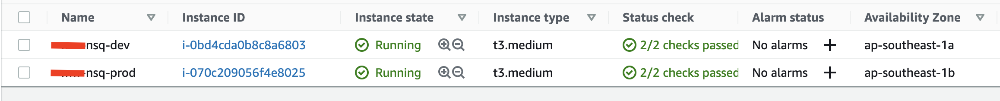
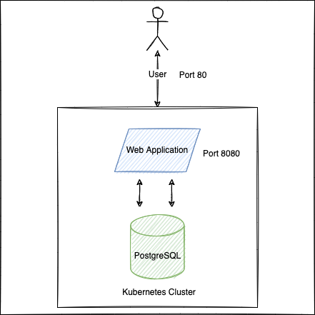

# Soal Test Case Bagian 1

1. Buat Terraform config dengan prinsip DRY (don’t repeat yourself) untuk membuat instance ec2 di Provider AWS dengan 2 environment variable yang berbeda untuk staging dan production.
   - Untuk staging menggunakan instance ukuran T2 small
   - Untuk production menggunakan instance ukuran T2 medium
***Note: jelaskan flow tersebut, dan harus identik penamaannya seperti test-dev & test-prod serta capture hasilnya (contoh hasil capturean di bawah ini)***

2. Buat Dockerfile untuk sonarqube, yang mana di dalamnya sudah terdapat plugin flutter, ansible lint dan yaml analyzer.
***Kirimkan jawabannya beserta capturean nya***

3. Asumsi, kita memiliki 10 nodes dengan sistem operasi linux tetapi di dalamnya belum terdapat monitoring tools. Agar kita mudah melakukan maintenance dan management sistem yang ada di 10 nodes tersebut, maka kita membutuhkan tools node_exporter dan prometheus. Buatkan ansible nya untuk menginstall node_exporter dan prometheus tersebut, jelaskan dan kirimkan hasil design arsitektur ke dua service diatas yang anda buat sendiri.

4. Setup web application sederhana dan database dengan menggunakan Kubernetes.
    - Web application dibuat dengan bahasa pemrograman Go/Golang dan berjalan di port 8080, kubernetes object dengan nama app.yaml
    - Database menggunakan Postgresql dan port default, kubernetes object dengan nama postgres.yaml
    - Web application diasumsikan sudah jadi, hanya perlu menggunakan image Go/Golang
    - Web application dan database di dalam satu Kubernetes cluster.
    - Hubungkan web application dan database melalui kubernetes object tersebut
    - Ketika user mengakses web application diharapkan melalui PORT 80 atau tanpa menuliskan specific PORT
    - Penjelasan ada pada gambar dibawah.

5. Jelaskan pertanyaan soal dibawah ini, boleh googling tetapi tidak boleh copy paste jelaskan menurut versi anda sendiri.
   - Mengapa memilih menggunakan layanan cloud daripada on-premise?
   - Apa perbedaan antara vertical scaling dan horizontal scaling?
   - Buat design infrastuktur untuk cloud (bebas menggunakan GCP atau AWS atau azure), dengan asumsi:
     - VPC
     - Subnet
     - Route
     - Kubernetes Cluster
     - Database
     - Storage (contoh, aws s3, google storage dll)
     - Image registry (contoh, aws ecr, container registry di gcp dll)